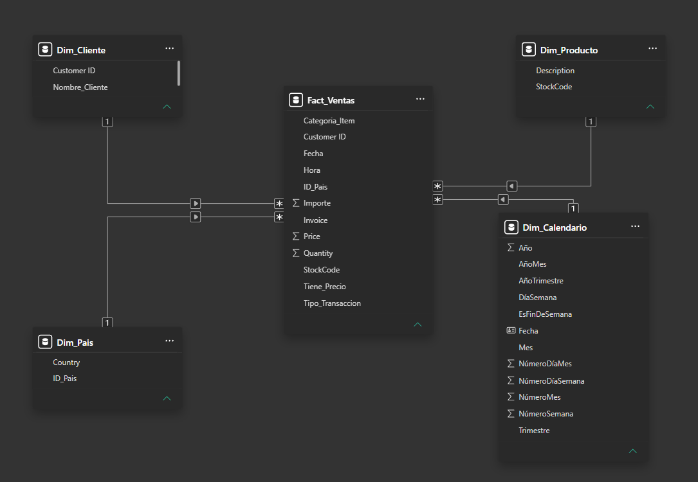
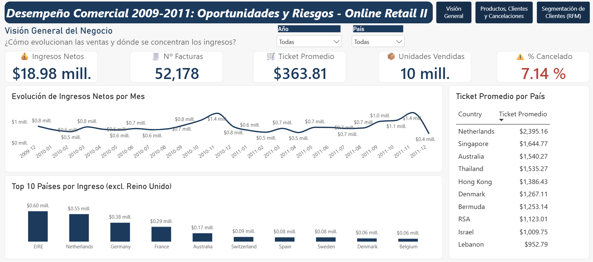
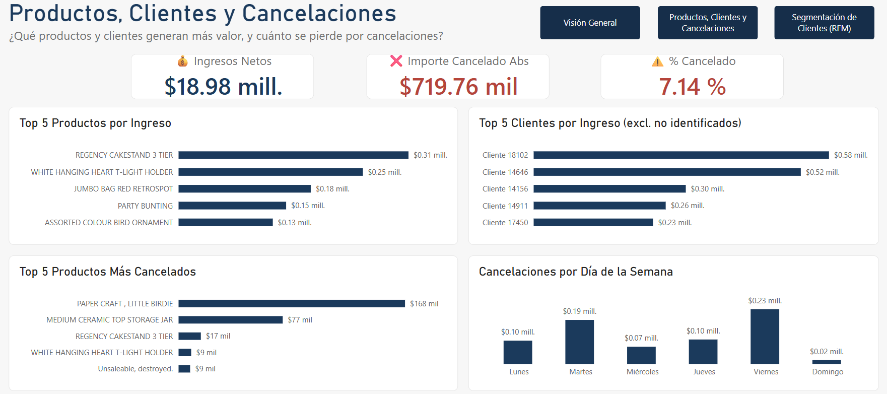
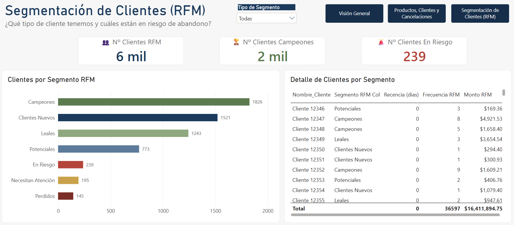

# 📊 Desempeño Comercial 2009-2011: Oportunidades y Riesgos — Online Retail II

Análisis de ventas, geografía, productos y segmentación de clientes de una tienda mayorista de artículos de regalo con sede en Reino Unido, construido en Power BI.

## Índice

1. [Contexto y Objetivo](#1--contexto-y-objetivo)
2. [Preguntas de Negocio y Respuestas](#2--preguntas-de-negocio-y-respuestas)
3. [Descripción del Dataset](#3--descripción-del-dataset)
4. [Limitaciones del Dataset](#4️⃣-limitaciones-del-dataset)
5. [Proceso de Transformación (Power Query)](#5--proceso-de-transformación-power-query)
6. [Modelo Dimensional](#6--modelo-dimensional)
7. [KPIs y Medidas DAX](#7--kpis-y-medidas-dax)
8. [Dashboard](#8--dashboard)
9. [Conclusiones y Recomendaciones](#9--conclusiones-y-recomendaciones)
10. [Cómo Reproducir](#10--cómo-reproducir)

## 1. 🎯 Contexto y Objetivo

Este proyecto analiza dos años de transacciones (diciembre 2009 – diciembre 2011) de una empresa mayorista de artículos de regalo y decoración, con sede en el Reino Unido y clientes en más de 40 países.

**Objetivo:** Convertir datos transaccionales en información que respalde decisiones de planificación comercial, gestión de inventario y retención de clientes.

**Pregunta principal:** ¿Dónde se concentran los ingresos del negocio (en el tiempo, por país y por producto), y cuánto valor se pierde por cancelaciones?

## 2. ❓ Preguntas de Negocio y Respuestas

| # | Pregunta | Hallazgo | Insight / Acción recomendada |
|---|---|---|---|
| 1 | ¿Cómo evolucionan las ventas mes a mes y qué tan fuerte es la estacionalidad? | Noviembre es el mes de mayor venta en ambos años (≈1.4 millones), impulsado por la temporada previa a Navidad. | La planificación de inventario y personal debe anticiparse a octubre-noviembre, no reaccionar en diciembre. Un pico predecible y repetido en 2 años es base suficiente para un plan de abastecimiento. |
| 2 | ¿Qué países y clientes concentran los ingresos, y cuánta dependencia hay de ellos? | Reino Unido concentra el 85.4% de los ingresos. El cliente más valioso es el Cliente 18102 ($0.58 millones). Netherlands, Singapore y Australia tienen el ticket promedio más alto (hasta 9x el general). | El negocio tiene **alta concentración de riesgo en un solo mercado**. Expandir en Netherlands/Singapore no requeriría una estrategia de volumen como en UK, sino identificar y fidelizar a pocos clientes mayoristas grandes, un enfoque comercial distinto y más barato de ejecutar. |
| 3 | ¿Qué productos generan la mayor parte del ingreso? | Regency Cakestand 3 Tier lidera con $0.31 millones, seguido de White Hanging Heart T-Light Holder ($0.25 millones). | Estos productos deben priorizarse en disponibilidad de stock y en visibilidad comercial; son los que más sostienen el ingreso total. |
| 4 | ¿Cuánto se pierde por cancelaciones y dónde se concentran? | 7.14% de lo vendido se cancela. Se concentra en viernes ($0.23 millones) y en un pedido atípico de 80,995 unidades de un solo producto. | La cifra global (7.14%) es manejable, pero no es un problema distribuido: es un **evento puntual más un patrón de día de la semana**. Vale la pena revisar el proceso de confirmación de pedidos grandes antes de despachar, y entender por qué los viernes concentran más ajustes de último momento. |
| 5 | ¿Qué tipos de cliente hay según RFM y cuáles están en riesgo de abandono? | 56.3% de la base son Campeones o Clientes Nuevos. Solo 6.4% (239 clientes) están En Riesgo de abandono. | La base de clientes es saludable en términos generales. El grupo pequeño "En Riesgo" es el de **mayor retorno por esfuerzo de retención**: son pocos clientes, identificables uno por uno en el panel 3, y recuperarlos cuesta menos que captar clientes nuevos. |

El detalle visual de cada hallazgo está en la sección [Dashboard](#8--dashboard).

## 3. 📦 Descripción del Dataset

Se utilizó el dataset público **Online Retail II**, disponible en el UCI Machine Learning Repository.

- **Fuente:** Chen, D. (2019). *Online Retail II* [Dataset]. UCI Machine Learning Repository.
- **Licencia:** CC BY 4.0
- **Período:** 1 diciembre 2009 – 9 diciembre 2011
- **Registros originales:** 1,067,371 filas, repartidas en 2 hojas de Excel (2009-2010 y 2010-2011)
- **Columnas originales:** Invoice, StockCode, Description, Quantity, InvoiceDate, Price, Customer ID, Country

## 4. Limitaciones del Dataset

- **Clientes sin identificar:** El 22.5% de las transacciones (235,281 filas) no tienen `Customer ID`. Se agruparon bajo "Cliente no identificado" y se excluyeron del análisis de clientes y RFM.
- **Diciembre 2011 incompleto:** Los datos de ese mes solo llegan hasta el día 9. La caída que se observa en la tendencia mensual no representa una baja real de demanda.
- **Productos sin descripción:** El 8% de los códigos de producto (424 de 5,303) no tienen descripción registrada en ninguna transacción.
- **Datos históricos:** El dataset cubre 2009-2011. El foco del proyecto es la metodología de análisis, replicable con datos actuales.

## 5. 🔧 Proceso de Transformación (Power Query)

El código completo de cada consulta está disponible en [`/powerquery`](./powerquery), organizado en dos grupos:

- **Consultas_Base:** `Ventas_2009_2010`, `Ventas_2010_2011`, `Ventas_Limpia` (limpieza, no se cargan al modelo)
- **Modelo:** `Fact_Ventas` + 4 dimensiones

### Decisiones clave de limpieza

| Paso | Decisión | Por qué |
|---|---|---|
| Combinar las 2 hojas | Se recortó `Ventas_2010_2011` para eliminar 22,523 filas duplicadas por el solape de fechas | Las hojas compartían el rango 1-9 dic 2010 |
| `Invoice` y `StockCode` a texto | Evita errores al identificar prefijos y mezclar tipos | Los códigos combinan letras y números |
| Exclusión de 6 filas "Adjust bad debt" | No son transacciones comerciales | Distorsionaban ingresos en -$147,614 |
| `Tipo_Transaccion` (Venta / Cancelación / Ajuste) | Basado en el prefijo "C" de `Invoice` y `Quantity` negativa sin prefijo | Permite separar ventas reales de cancelaciones y ajustes de inventario |
| `Categoria_Item` (Producto / No_Producto) | 17 códigos excluidos (POST, DOT, BANK CHARGES, AMAZONFEE, etc.) | Evita mezclar cargos administrativos con ventas de producto |
| Estandarización de `StockCode` a mayúsculas | Se detectaron 173 códigos duplicados por mayúsculas/minúsculas | Necesario para relaciones 1 a muchos válidas en el modelo |
| `Customer ID` nulo → 0 | Se creó la fila "Cliente no identificado" en `Dim_Cliente` | Evita perder esas ventas de los totales generales |

## 6. 🧩 Modelo Dimensional

Esquema en estrella con una tabla de hechos y 4 dimensiones:

| Tabla | Filas | Descripción |
|---|---|---|
| `Fact_Ventas` | 1,044,842 | Una fila por línea de factura |
| `Dim_Producto` | 5,303 | Un producto por fila |
| `Dim_Cliente` | 5,943 | Un cliente por fila (incluye "Cliente no identificado") |
| `Dim_Pais` | 43 | Un país por fila |
| `Dim_Calendario` | 1,095 | Una fecha por fila (2009-2011), marcada como tabla de fechas oficial |

## 7. 📐 KPIs y Medidas DAX

Documentación completa de las 21 medidas, con su tipo de dato, en [`/documentation/medidas_dax.md`](./documentation/medidas_dax.md).

**KPIs principales:**

| KPI | Valor |
|---|---|
| Ingresos Netos | $18.98 millones |
| Nº Facturas | 52,000 |
| Ticket Promedio | $363.82 |
| Unidades Vendidas | 10 millones |
| % Cancelado | 7.14% |

## 8. 📊 Dashboard

### Panel 1 — Visión General del Negocio

*Responde las preguntas 1 y 2.*

- **Estacionalidad:** Noviembre es el mes de mayor venta en ambos años, consistente con la temporada previa a Navidad.
- **Concentración geográfica:** Reino Unido representa el 85.4% de los ingresos. El resto es mayoritariamente europeo, con Australia como excepción.
- **Ticket alto vs. volumen alto:** Netherlands, Singapore y Australia muestran un ticket promedio hasta 9 veces superior al general, un patrón de negocio distinto al de Reino Unido.

### Panel 2 — Productos, Clientes y Cancelaciones

*Responde las preguntas 2, 3 y 4.*

- **Productos:** Regency Cakestand 3 Tier lidera con $0.31 millones.
- **Clientes:** El Cliente 18102 es el más valioso, con $0.58 millones.
- **Cancelaciones:** El producto más cancelado, Paper Craft Little Birdie, se explica en gran parte por un pedido atípico de 80,995 unidades. Los viernes concentran más cancelaciones que cualquier otro día.

### Panel 3 — Segmentación de Clientes (RFM)

*Responde la pregunta 5.*

Segmentación con metodología RFM (Recencia, Frecuencia, Monto), por quintiles (`RANKX`), sobre los 5,942 clientes identificados:

| Segmento | Clientes | % |
|---|---|---|
| Campeones | 1,826 | 30.7% |
| Clientes Nuevos | 1,521 | 25.6% |
| Leales | 1,243 | 20.9% |
| Potenciales | 773 | 13.0% |
| En Riesgo | 239 | 4.0% |
| Necesitan Atención | 195 | 3.3% |
| Perdidos | 145 | 2.4% |

## 9. 💡 Conclusiones y Recomendaciones

- **El negocio depende fuertemente de un mercado (Reino Unido, 85%)**, pero tiene oportunidades claras en mercados de ticket alto como Netherlands y Singapore, donde priorizar pocos clientes mayoristas grandes podría ser más eficiente que una estrategia de volumen.
- **La base de clientes está mayormente sana:** el 56.3% son Campeones o Clientes Nuevos, y solo el 6.4% requiere atención de retención inmediata.
- **Las cancelaciones son manejables (7.14%)**, pero no distribuidas al azar: se concentran en viernes y en pedidos atípicos de alto volumen, un punto operativo concreto a revisar.
